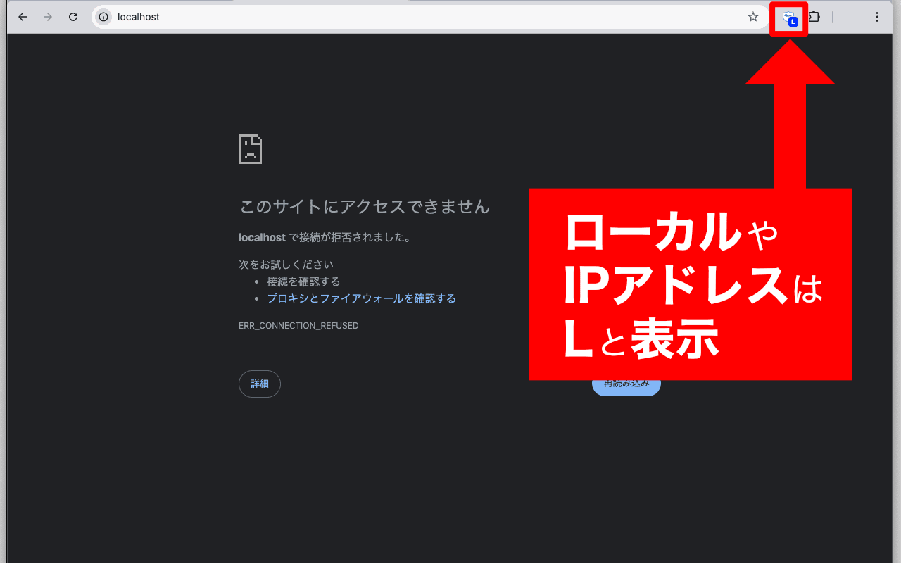
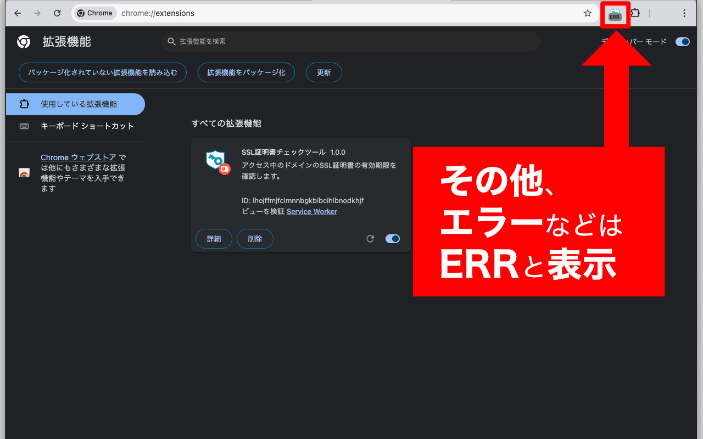

# SSL証明書チェックツール Chrome 拡張

アクセス中のウェブサイトの SSL 証明書有効期限と種類（DV/OV/EV）をアイコンバッジとポップアップで確認できる Chrome 拡張です。

---

## 📦 目次

- [スクリーンショット](#スクリーンショット)  
- [機能](#機能)  
- [必要条件](#必要条件)  
- [インストール](#インストール)  
- [開発・ビルド手順](#開発・ビルド手順)  
- [使い方](#使い方)  
- [環境変数](#環境変数)  
- [ディレクトリ構成](#ディレクトリ構成)  
- [ライセンス](#ライセンス)  

---

## 🖼 スクリーンショット

  
*SSL証明書の有効日数表示*

  
*アイコンクリック時の表示*

  
*ローカルやIPアドレスの場合の表記*

  
*エラーの場合の表記*


## 🔧 機能

- **アイコンバッジ** に残り日数を表示  
  - 7日以内：オレンジ  
  - 8日以上：緑  
  - 期限切れ：✖（赤）  
  - ローカル環境：L（青）  
- **ポップアップ** で詳細表示  
  - 発行者（Issuer）  
  - 有効期間（Valid From ～ Valid To）  
  - 証明書タイプ（DV/OV/EV）  
- **キャッシュ機能**（60秒 TTL）で同一ドメインへの過剰リクエストを防止  

---

## ✅ 必要条件

- Chrome または Chromium 系ブラウザ（Manifest V3 対応）  
- bash が動く環境（ビルドスクリプト用）  
- サーバー側に SSL チェック API を用意  

---

## 🚀 インストール

1. リポジトリを clone  
   ```bash
   git clone https://github.com/grooveline/ssl-research.git
   cd ssl-research/ssl-research
   ```

2. **環境変数**に API キーを設定  
   ```bash
   export CHROME_API_KEY="YOUR_REAL_API_KEY"
   ```

3. ビルドスクリプトを実行  
   ```bash
   ./build.sh
   ```

4. Chrome 拡張の管理画面を開き（`chrome://extensions/`）、「パッケージ化されていない拡張機能を読み込む」→ `dist/` フォルダを指定  

---

## 🛠 開発・ビルド手順

1. **プレースホルダー設定**  
   - `background.js`／`popup.js` 内の `__API_KEY__` がビルド時に置換されます。  

2. **ビルドスクリプト (`build.sh`) の流れ**  
   - `dist/` を再生成  
   - 静的ファイル（`manifest.json`・`popup.html`・アイコン）をコピー  
   - `sed` で `__API_KEY__` → 実際のキーに置換  
   - 生成後ファイルを `dist/` 配下に出力  

3. **dist/**  
   - `dist/manifest.json`  
   - `dist/background.js`（キー注入済み + minify 可）  
   - `dist/popup.html`  
   - `dist/popup.js`（キー注入済み + minify 可）  
   - `dist/icon*.png`  

> **注**：`dist/` およびビルドスクリプトは `.gitignore` に含まれており、リポジトリには公開されません。

---

## 🎯 使い方

1. ブラウザで任意のウェブサイトを開く  
2. 拡張アイコンをクリックすると自動で SSL チェック  
3. アイコンバッジに残り日数が表示  
4. ポップアップで詳細情報を確認  

---

## 🔑 環境変数

- `CHROME_API_KEY`  
  - あなたの SSL チェック API 用キー  
  - **ビルド前に必ず設定**する  

---

## 📁 ディレクトリ構成

```
ssl-research/
└─ ssl-research/
   ├─ background.js           # テンプレート（__API_KEY__ プレースホルダー）
   ├─ popup.js                # テンプレート（__API_KEY__ プレースホルダー）
   ├─ popup.html
   ├─ manifest.json
   ├─ icon16.png / icon48.png / icon128.png
   ├─ build.sh                # ビルドスクリプト
   ├─ dist/                   # ビルド成果物（git 管理外）
   └─ .gitignore
```

---

## 📄 ライセンス

MIT License  
詳しくは [LICENSE](./LICENSE) をご覧ください。  
